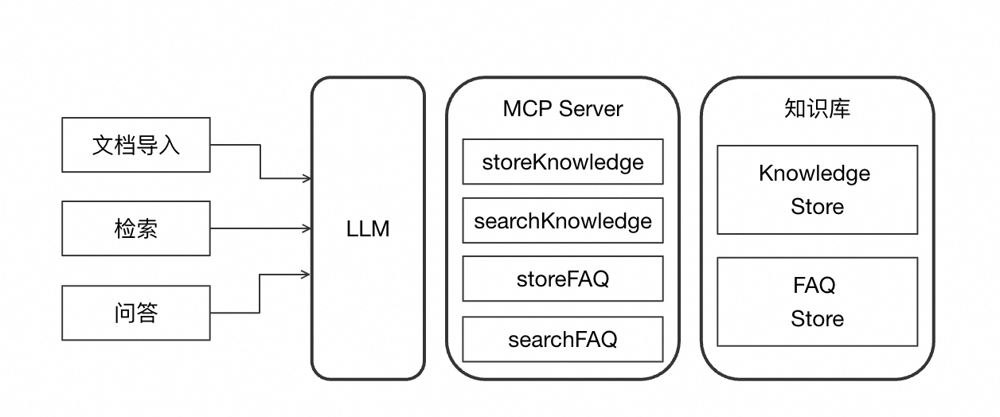

# MCP In Action

## 简介

MCP In Action 是一个实战项目，旨在帮助开发者快速掌握 Model Context Protocol (MCP) 的开发与应用。本项目通过实际案例展示如何构建基于 MCP 的应用，使大语言模型能够与外部工具和数据源进行交互，从而增强模型的能力范围。

## 文档
1. [MCP实战入门：让AI模型获取实时天气信息](https://mp.weixin.qq.com/s/cJhHf7caaezehEff2GSY_A)
2. [MCP实战进阶：集成DeepSeek模型与MCP的天气信息助手](https://mp.weixin.qq.com/s/1YIYRVw8yF1zeeLtmnhtYQ)
3. [MCP实战高阶：借助LangChain快速打造MCP天气助手](https://mp.weixin.qq.com/s/Qq3C85Bi3NHDQ9MnnBZvZQ)
4. [RAG不好用？试试MCP这个“知识库优化大师”](https://mp.weixin.qq.com/s/SOVXbU8Lw131EFCMmMlpmA)

## 项目架构

本仓库包含以下主要项目：

### 项目1：[mcp-opensource](https://github.com/FlyAIBox/mcp-in-action/tree/main/mcp-opensource)
这个项目展示了 MCP 的开源工具，平台等。

### 项目2：[mcp-demo](https://github.com/FlyAIBox/mcp-in-action/tree/main/mcp-demo)

这个项目展示了 MCP 的基础应用，通过搭建客户端-服务器架构，让 AI 模型能够访问实时天气信息。

#### 核心功能

- **MCP 服务器开发**：从零构建符合 MCP 规范的服务器
- **MCP 服务器调试**：提供调试方法和最佳实践
- **MCP 客户端开发**：实现与服务器通信的客户端
- **DeepSeek集成**：MCP客户端集成DeepSeek大模型
- **LangChain 集成**：在 LangChain 框架中使用 MCP 服务器

#### MCP Server 进阶
- **Desktop 加载**：将 MCP 服务集成到桌面应用程序
- **Prompt 管理**：优化和管理模型提示
- **Resource 处理**：外部资源调用与管理
- **生命周期管理**：控制 MCP 服务的完整生命周期
- **云端部署**：将 MCP 服务部署到云端(阿里云/mcp.so)

### 项目3：[mcp-rag](https://github.com/FlyAIBox/mcp-in-action/tree/main/mcp-rag)

这个项目专注于将 MCP 与检索增强生成 (RAG) 技术结合，展示如何通过 MCP 实现更高级的知识检索和信息整合能力。
#### 项目目标

本项目旨在**构建一个基于MCP的企业RAG系统**，实现以下具体目标：

**目标**
- 构建支持MCP协议的知识库服务和客户端
- 实现文档智能切分、FAQ自动提取功能
- 支持复杂问题的拆解和混合检索策略

#### 项目系统设计与实现

> 本项目系统设计参考自[alibabacloud-tablestore-mcp-server](https://github.com/aliyun/alibabacloud-tablestore-mcp-server)，由于`alibabacloud-tablestore-mcp-server`项目使用Tablestore存储和Java实现的MCP Server，不方便于后期扩展和迭代。
>
> 本项目改造为Milvus存储和Python实现MCP Server和MCP  Client，代码全部重写（cursor帮忙不少）。
>
> 以下设计和流程皆为`alibabacloud-tablestore-mcp-server`内容，在此感谢@xjtushilei 开源的`alibabacloud-tablestore-mcp-server`。

我们构建的基于MCP的RAG系统主要包含三个核心部分：

1. **知识库服务(MCP Server)**：基于Milvus向量数据库实现的后端服务，负责文档存储和检索
2. **客户端工具(MCP Client)**：与MCP Server通信的客户端，实现知识库的构建和检索功能
3. **大模型集成**：通过LLM实现文档切分、FAQ提取、问题拆解和回答生成等核心功能

主要分为两部分：知识库构建和检索。

1. **知识库构建**
   1. **文本切段：** 对文本进行切段，切段后的内容需要保证文本完整性以及语义完整性。
   2. **提取 FAQ：** 根据文本内容提取 FAQ，作为知识库检索的一个补充，以提升检索效果。
   3. **导入知识库：** 将文本和 FAQ 导入知识库，并进行 Embedding 后导入向量。
2. **知识检索（RAG）**
   1. **问题拆解：** 对输入问题进行拆解和重写，拆解为更原子的子问题。
   2. **检索：** 针对每个子问题分别检索相关文本和 FAQ，针对文本采取向量检索，针对 FAQ 采取全文和向量混合检索。
   3. **知识库内容筛选：** 针对检索出来的内容进行筛选，保留与问题最相关的内容进行参考回答。

相比传统的 Naive RAG，在知识库构建和检索分别做了一些常见的优化，包括 Chunk 切分优化、提取 FAQ、Query Rewrite、混合检索等。

##### 流程

本Agent整体架构分为三个部分：

1. **知识库：** 内部包含 Knowledge Store 和 FAQ Store，分别存储文本内容和 FAQ 内容，支持向量和全文的混合检索。
2. **MCP Server：** 提供对 Knowledge Store 和 FAQ Store 的读写操作，总共提供 4 个 Tools。
3. **功能实现部分：** 完全通过 Prompt + LLM 来实现对知识库的导入、检索和问答这几个功能。

#### 项目结构

项目结构分为两部分：

1. **`milvus-mcp-client`：** Python 实现的 Client 端，实现了与大模型进行交互，通过 MCP Client 获取 Tools，根据大模型的反馈调用 Tools 等基本能力。通过 Prompt 实现了知识库构建、检索和问答三个主要功能。
2. **`milvus-mcp-server`：** Python 实现的 Server 端，基于 MCP 框架实现的服务，提供了连接 Milvus 向量数据库的接口，支持知识库的存储和检索功能。

## 贡献指南

欢迎通过以下方式为项目做出贡献：

1. Fork 仓库
2. 创建功能分支 (`git checkout -b feature/amazing-feature`)
3. 提交更改 (`git commit -m 'Add some amazing feature'`)
4. 推送到分支 (`git push origin feature/amazing-feature`)
5. 创建 Pull Request

贡献是使开源社区成为学习、激励和创造的惊人之处。非常感谢你所做的任何贡献。如果你有任何建议或功能请求，请先开启一个议题讨论你想要改变的内容。

## 许可证
该项目根据Apache-2.0许可证的条款进行许可。详情请参见[LICENSE](LICENSE)文件。

本项目采用 [Apache 许可证](LICENSE)。

## 联系方式

- 项目维护者：[FlyAIBox](https://github.com/FlyAIBox)
- 问题反馈：请使用 [GitHub Issues](https://github.com/FlyAIBox/mcp-in-action/issues)

---

**Model Context Protocol** - 让 AI 模型拥有与世界交互的能力

# ⭐️⭐️⭐️⭐️⭐️

<a href="https://star-history.com/#FlyAIBox/mcp-in-action&Date">
  <picture>
    <source media="(prefers-color-scheme: dark)" srcset="https://api.star-history.com/svg?repos=FlyAIBox/mcp-in-action&type=Date&theme=dark" />
    <source media="(prefers-color-scheme: light)" srcset="https://api.star-history.com/svg?repos=FlyAIBox/mcp-in-action&type=Date" />
    
  </picture>
</a>