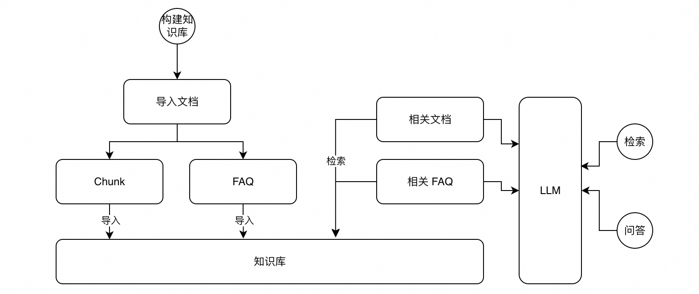

# MCP RAG Demo for Tablestore

# 整体流程设计


主要分为两部分：知识库构建和检索。

1. 知识库构建
    1. 文本切段：对文本进行切段，切段后的内容需要保证文本完整性以及语义完整性。
    2. 提取 FAQ：根据文本内容提取 FAQ，作为知识库检索的一个补充，以提升检索效果。
    3. 导入知识库：将文本和 FAQ 导入知识库，并进行 Embedding 后导入向量。
 2. 知识检索（RAG）
    1. 问题拆解：对输入问题进行拆解和重写，拆解为更原子的子问题。
    2. 检索：针对每个子问题分别检索相关文本和 FAQ，针对文本采取向量检索，针对 FAQ 采取全文和向量混合检索。
    3. 知识库内容筛选：针对检索出来的内容进行筛选，保留与问题最相关的内容进行参考回答。

相比传统的 Naive RAG，在知识库构建和检索分别做了一些常见的优化，包括 Chunk 切分优化、提取 FAQ、Query Rewrite、混合检索等。


# 具体实现

### 流程


本Agent整体架构分为三个部分：
1. 知识库：内部包含 Knowledge Store 和 FAQ Store，分别存储文本内容和 FAQ 内容，支持向量和全文的混合检索。
2. MCP Server：提供对 Knowledge Store 和 FAQ Store 的读写操作，总共提供 4 个 Tools。
3. 功能实现部分：完全通过 Prompt + LLM 来实现对知识库的导入、检索和问答这几个功能。

### 代码
所有代码分为两部分：
1. `mcp-client`：Python 实现的 Client 端，实现了与大模型进行交互，通过 MCP Client 获取 Tools，根据大模型的反馈调用 Tools 等基本能力。通过 Prompt 实现了知识库构建、检索和问答三个主要功能。
2. `milvus-mcp-server`：Python 实现的 Server 端，基于 MCP 框架实现的服务，提供了连接 Milvus 向量数据库的接口，支持知识库的存储和检索功能。

## 安装和运行

### 环境准备
1. Python 3.10+
2. Milvus 向量数据库

### 服务端配置与运行
1. 安装依赖：
```
cd milvus-mcp-server
pip install -r requirements.txt
```

2. 启动服务端：
```
python -m app.main
```

### 客户端配置与运行
1. 安装依赖：
```
cd mcp-client
pip install -r requirements.txt
```

2. 设置环境变量（使用提供的脚本）：
```
cd mcp-client
chmod +x run.sh
./run.sh import <文档路径>
```

3. 或手动设置环境变量：
```
export LLM_API_KEY="你的 API Key"
export MCP_SERVER_HOST="http://localhost:8080/sse"
export LLM_API_BASE_URL="https://dashscope.aliyuncs.com/compatible-mode/v1"
export LLM_MODEL="qwen-max"
python knowledge_manager.py import <文档路径>
```

## 功能使用

1. 导入知识：
```
./run.sh import 文档路径.md
```

2. 搜索知识：
```
./run.sh search "搜索关键词"
```

3. 智能问答：
```
./run.sh chat "你的问题"
```

## 使用推荐方式

为解决服务启动时序问题，我们提供了一个自动化脚本 `mcprag.sh`，它会正确地启动服务端和客户端：

```
chmod +x mcprag.sh
./mcprag.sh import 文档路径.md
```

此脚本会：
1. 停止任何正在运行的MCP服务器实例
2. 启动Milvus MCP服务器
3. 等待10秒让服务器完全初始化
4. 运行客户端命令

## 故障排除

### 如果遇到以下错误：
```
RuntimeError: Received request before initialization was complete
```

这个错误表示客户端在服务器初始化完成前就发送了请求。解决方法：

1. 使用 `mcprag.sh` 脚本，它会自动处理初始化时序
2. 或者手动操作：
   - 确保先完全启动服务端 `cd milvus-mcp-server && ./run.sh`
   - 等待10-15秒，让服务端完全初始化
   - 然后再启动客户端 `cd mcp-client && ./run.sh <命令>`

### 服务端和客户端的改进

最新版本已经对代码进行了优化：
1. 客户端增加了重试机制，在连接失败时会自动等待并重试
2. 服务端增加了初始化信号，确保只有在完全准备好后才接受连接
3. 增加了错误处理和日志记录，以便更好地诊断问题
