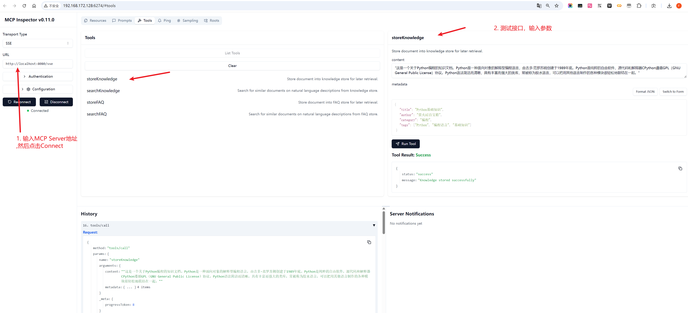

# Milvus MCP 服务器

基于 Milvus 向量数据库的 MCP（模型上下文协议）服务器的 Python 实现。

> [模型上下文协议 (MCP)](https://modelcontextprotocol.io/introduction) 是一个开放协议，支持大型语言模型 (LLM) 应用程序与外部数据源和工具的无缝集成。
> 无论您是开发 AI 驱动的集成开发环境 (IDE)，增强聊天界面功能，还是创建自定义 AI 工作流，MCP 都为有效连接 LLM 与其所需的关键上下文信息提供了标准化解决方案。

这个 MCP 服务器的 Python 实现提供了与原始 tablestore-mcp-server 相同的 API，但使用 Milvus 作为向量数据库后端。

## 前提条件

1. Docker 和 Docker Compose
2. 至少 4CPU; 4GB 可用内存
3. 至少 10GB 可用磁盘空间

## 部署方式

### 方式一：使用 Docker Compose（推荐）

这是最简单的部署方式，所有组件（包括 Milvus、MinIO、etcd 和 MCP 服务器）都会自动配置和启动。

1. 进入项目目录：
```bash
cd milvus-mcp-server
```

2. 启动所有服务：
```bash
docker-compose up -d

docker compose -f docker-compose-base.yml up -d --force-recreate
```

服务启动后，MCP 服务器将在 http://localhost:8080 上可用。

各个服务的端口映射：
- MCP 服务器: 8080
- Milvus: 19530
- Milvus 监控: 9091

如需查看服务日志：
```bash
# 查看所有服务日志
docker-compose logs -f

# 查看特定服务日志（例如 mcp-server）
docker compose logs -f mcp-server
```

停止服务：
```bash
docker compose down
```

### 方式二：本地开发环境

如果您需要进行开发或调试，可以选择本地部署方式。

1. 首先启动 Milvus 及其依赖服务：
```bash
docker compose up -d etcd minio standalone
```

2. 创建 Python 虚拟环境：
```bash
# 在mcp-rag目录创建
cd ..
python -m venv env-mcp-rag
source env-mcp-rag/bin/activate  
```

3. 安装依赖：
```bash
pip install -r requirements.txt
```

4. 配置环境变量：
创建 `.env` 文件并添加以下配置：
```
MILVUS_HOST=localhost
MILVUS_PORT=19530
EMBEDDING_MODEL=all-MiniLM-L6-v2
KNOWLEDGE_COLLECTION=knowledge_store
FAQ_COLLECTION=faq_store
VECTOR_DIMENSION=384
```

5. 启动服务器：
```bash
python -m app.main
```
启动成功信息
```bash
(env-mcp-rag) root@fly:~/AI-Box/code/rag/flyaibox-mcp-rag/milvus-mcp-server# python -m app.main
2025-04-26 23:14:00 | INFO     | __main__:<module>:18 - Starting Milvus MCP Server on port 8080
INFO:     Started server process [13541]
INFO:     Waiting for application startup.
INFO:     Application startup complete.
INFO:     Uvicorn running on http://0.0.0.0:8080 (Press CTRL+C to quit)
INFO:     192.168.172.1:13398 - "GET /docs HTTP/1.1" 404 Not Found
INFO:     192.168.172.1:13398 - "GET / HTTP/1.1" 404 Not Found
INFO:     192.168.172.1:13398 - "GET /sse HTTP/1.1" 200 OK
```
6. 验证服务器是否启动成功：
http://192.168.172.128:8080/sse

```bash
event: endpoint
data: /messages/?session_id=fef8120bae4d49508a96fa546e613329
: ping - 2025-04-26 15:14:49.974582+00:00
: ping - 2025-04-26 15:15:04.977367+00:00
: ping - 2025-04-26 15:15:19.979094+00:00
: ping - 2025-04-26 15:15:34.983508+00:00
: ping - 2025-04-26 15:15:49.985639+00:00
: ping - 2025-04-26 15:16:04.989747+00:00

```

7. 本地调试: sse 模式

首先启动服务器`python -m app.main`，然后运行可视化调试界面 MCP Inspector, 根据 Terminal的日志提示打开"http://localhost:5173"进行调试。
```bash
  # 启动 MCP Inspector
  npx @modelcontextprotocol/inspector node build/index.js
```
启动效果
```bash
(env-mcp-rag) root@fly:~/AI-Box/code/rag/mcp-in-action/mcp-rag/milvus-mcp-server# npx @modelcontextprotocol/inspector node build/index.js
Starting MCP inspector...
⚙️ Proxy server listening on port 6277
🔍 MCP Inspector is up and running at http://127.0.0.1:6274 🚀
```

8. 工具测试
参考：MCP-Tools-测试文档.md，如下：


## 系统资源配置说明

当前配置针对中小规模应用优化，各服务的资源限制如下：
- etcd: 0.5 CPU, 512MB 内存
- MinIO: 0.5 CPU, 512MB 内存
- Milvus: 0.5 CPU, 512MB 内存
- MCP 服务器: 0.5 CPU, 512MB 内存

如需调整资源配置，请修改 `docker-compose.yml` 中相应服务的 `deploy.resources` 部分。

## API 端点

服务器提供以下 MCP API 端点：

- `POST /api/v1/storeKnowledge`: 将文档存储到知识库
- `POST /api/v1/searchKnowledge`: 在知识库中搜索相似文档
- `POST /api/v1/storeFAQ`: 存储常见问题解答内容
- `POST /api/v1/searchFAQ`: 搜索相似的常见问题解答内容

## 提供的工具

以下工具可供 MCP 客户端使用：

1. `storeKnowledge`: 将文档存储到知识库中以便日后检索
2. `searchKnowledge`: 在知识库中搜索相似文档
3. `storeFAQ`: 将文档存储到常见问题解答库中以便日后检索
4. `searchFAQ`: 在常见问题解答库中搜索相似文档

## 与 MCP 客户端一起使用

该服务器与任何 MCP 客户端兼容。要使用它，请将您的 MCP 客户端指向服务器 URL。

## 参考文档
1. milvus 可视化客户端--Attu桌面快速入门：https://milvus.io/docs/zh/quickstart_with_attu.md