# tablestore-mcp-server

A Tablestore Python MCP Server.

> [模型上下文协议（Model Context Protocol，MCP）](https://modelcontextprotocol.io/introduction)是一个开放协议，支持大型语言模型（LLM）应用程序与外部数据源及工具之间的无缝集成。
> 无论是开发AI驱动的集成开发环境（IDE）、增强聊天界面功能，还是创建定制化AI工作流，MCP均提供了一种标准化方案，
> 可将LLMs与其所需的关键背景信息高效连接。

这篇文章介绍如何基于Tablestore(表格存储)构建一个MCP服务，使用其向量和标量的混合检索，提供检索相关的 tool 能力。

# 1. 效果

这里展示 2 个 tool 的能力，一个是存储工具，一个是搜索工具。 我们使用的软件是热门的开源软件 [cherry-studio](https://github.com/CherryHQ/cherry-studio)，
使用的大模型是通义千问的 `qwen-max` 模型

## 1.1 写入到Tablestore

`cherry-studio` 使用示例如下图:

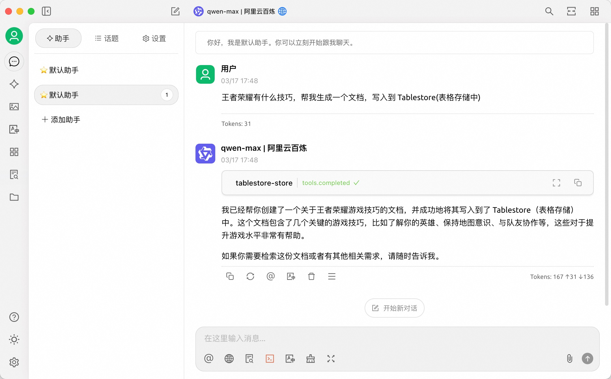

`python` Server 端代码的写入日志如下图:

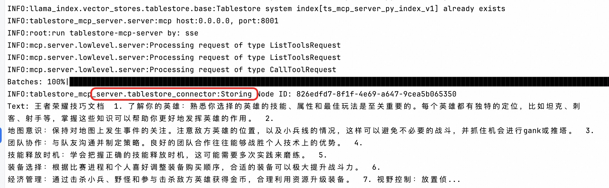

Tablestore(表格存储) 控制台数据存储结果如下图:

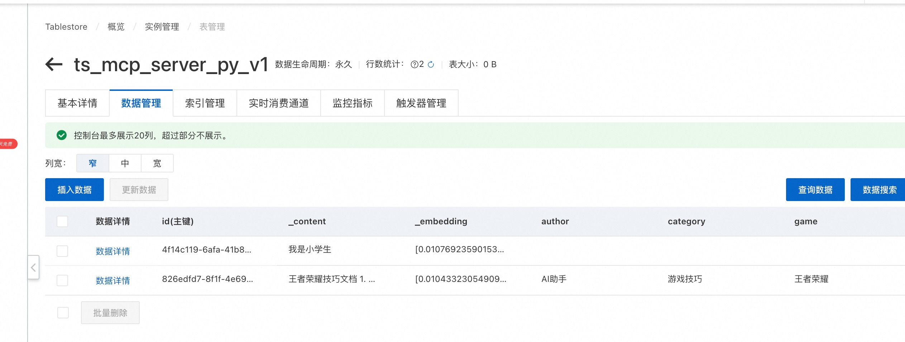

## 1.2 搜索文档

Tablestore(表格存储) 的多元索引支持向量、标量、全文检索等各种类型的组合查询，该示例代码中使用了混合检索，如需更复杂的查询，可以参考文章最后的“贡献代码和二次开发”章节了解如何自定义开发。

`cherry-studio` 搜索查询示例如下图:

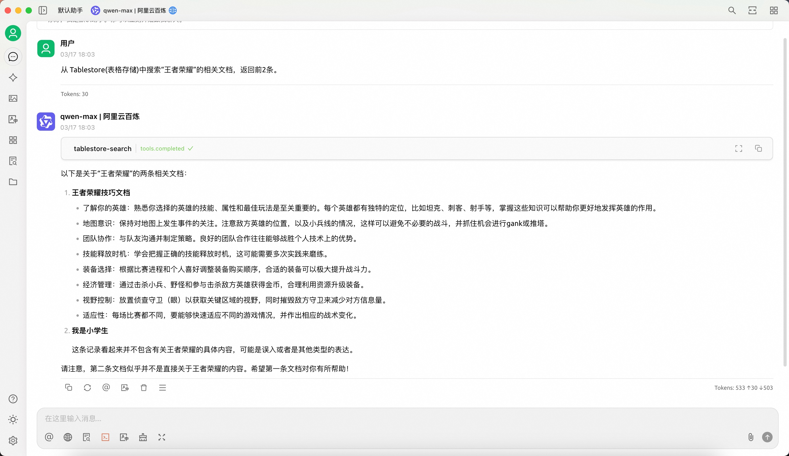

`python` Server 端的查询日志如下图:

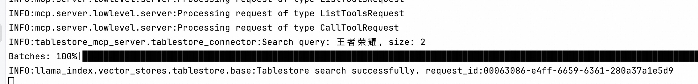

Tablestore(表格存储) 控制台数据也可以进行查询，这里以全文检索示例:

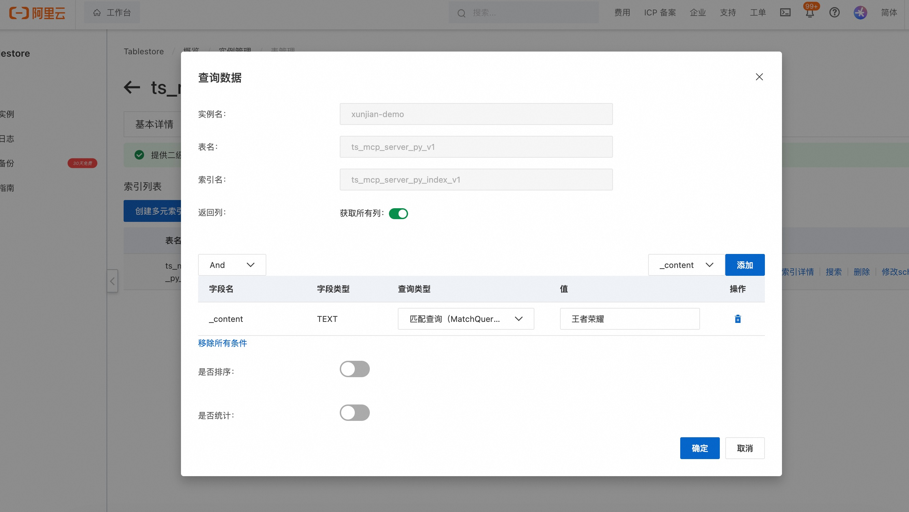

# 2. 流程

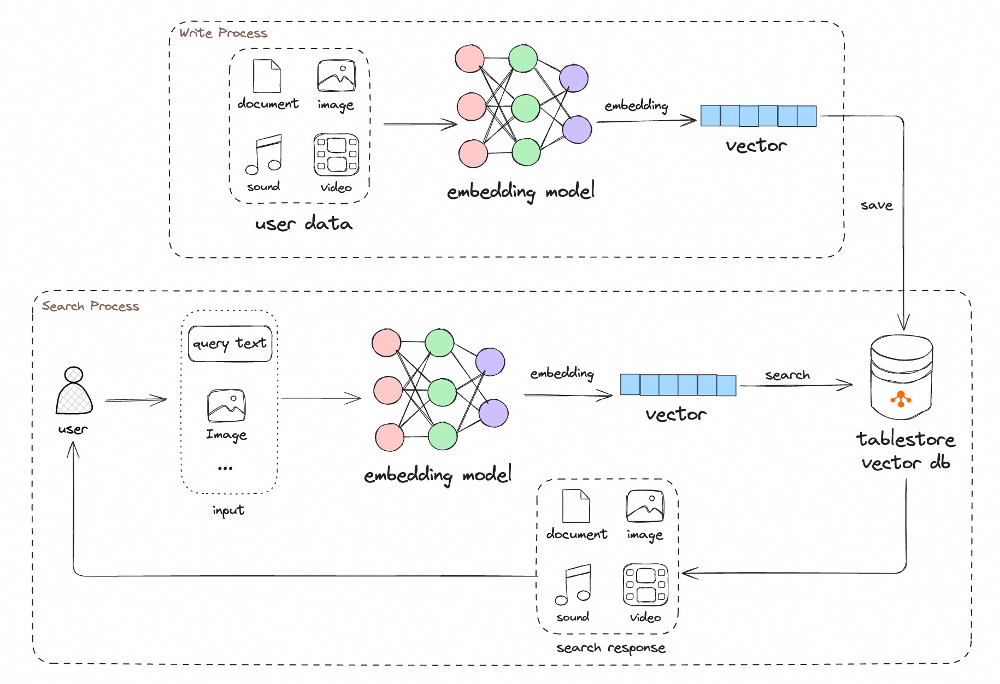

MCP server 提供的 2 个工具十分简单：

1. 写入: 文档经过 MCP server 内置的 Embedding ( 默认为 [BAAI/bge-base-zh-v1.5](https://huggingface.co/BAAI/bge-base-zh-v1.5) ) 模型，写入到Tablestore(表格存储)即可。
2. 查询: 用户的查询文本经过 MCP server 内置的 Embedding 模型转成向量，然后调用表格存储的 [多元索引](https://help.aliyun.com/zh/tablestore/features-of-search-index)即可，其内部使用了
   [向量检索](https://help.aliyun.com/zh/tablestore/knn-vector-query-function/) 和 [全文检索](https://help.aliyun.com/zh/tablestore/full-text-search-of-search-index/) 进行混合查询，最终召回用户期望的结果。

# 3. 本地运行

## 3.1 下载源码

1. 使用 `git clone` 将代码下载到本地。
2. 进入 python 源码的根目录：`cd tablestore-mcp-server/tablestore-python-mcp-server`

## 3.2 准备环境

代码需要 `python3.10` 版本以上进行构建，使用了  [`uv`](https://docs.astral.sh/uv) 进行包和环境管理。

安装 uv：

```bash
  # 方式1：使用现有 python3 安装 uv
  pip3 install uv
  # 方式2：源码安装 uv:
  curl -LsSf https://astral.sh/uv/install.sh | sh
```

准备 Python 环境：
> 如果本地有 `python3.10` 版本以上环境，无需执行这一小步。

因为我们项目至少需要 `python3.10` 版本，这里使用 `python3.12` 进行示例。

```bash
  # 查看当前有哪些 python 环境
  uv python list
  # 如果没有python 3.12.x 相关版本，请安装 python3.12 版本. 内部会从 github 下载 uv 官方维护的 python 包。 
  uv python install 3.12
```

创建虚拟环境:

```bash
  # 使用 python 3.12 版本当做虚拟环境
  uv venv --python 3.12
```

## 3.3 配置环境变量

代码里所有的配置是通过环境变量来实现的，出完整的变量见下方表格。 主要依赖的数据库 [Tablestore(表格存储)](https://www.aliyun.com/product/ots) 支持按量付费，使用该工具，表和索引都会自动创建，仅需要在控制台上申请一个实例即可。

| 变量名                          |                              必填                              |                             含义                              |                              默认值                               |
|------------------------------|:------------------------------------------------------------:|:-----------------------------------------------------------:|:--------------------------------------------------------------:|
| SERVER_HOST                  |                             _否_                              |                      MCP server 的 host                      |                            0.0.0.0                             |
| SERVER_PORT                  |                             _否_                              |                      MCP server 的 port                      |                              8001                              |
| TABLESTORE_INSTANCE_NAME     | <span style="color:red; font-weight:bold;">**是(yes)**</span> |                             实例名                             |                               -                                |
| TABLESTORE_ENDPOINT          | <span style="color:red; font-weight:bold;">**是(yes)**</span> |                           实例访问地址                            |                               -                                |
| TABLESTORE_ACCESS_KEY_ID     | <span style="color:red; font-weight:bold;">**是(yes)**</span> |                            秘钥 ID                            |                               -                                |
| TABLESTORE_ACCESS_KEY_SECRET | <span style="color:red; font-weight:bold;">**是(yes)**</span> |                          秘钥 SECRET                          |                               -                                |
| TABLESTORE_TABLE_NAME        |                             _否_                              |                             表名                              |                      ts_mcp_server_py_v1                       |
| TABLESTORE_INDEX_NAME        |                             _否_                              |                             索引名                             |                   ts_mcp_server_py_index_v1                    |
| TABLESTORE_VECTOR_DIMENSION  |                             _否_                              |                            向量维度                             |                              768                               |
| TABLESTORE_TEXT_FIELD        |                             _否_                              |                            文本字段名                            |                            _content                            |
| TABLESTORE_VECTOR_FIELD      |                             _否_                              |                            向量字段名                            |                           _embedding                           |
| EMBEDDING_PROVIDER_TYPE      |                             _否_                              |        Embedding 模型提供者: 目前包括：hugging_face、dashscope         |                hugging_face                |
| EMBEDDING_MODEL_NAME         |                             _否_                              |                       Embedding 模型名字                        | BAAI/bge-base-zh-v1.5(维度是768，和 TABLESTORE_VECTOR_DIMENSION 呼应) |
| DASHSCOPE_API_KEY         |                             _否_                              | 百炼的API_KEY(当EMBEDDING_PROVIDER_TYPE为 dashscope 时候，需要提供该参数) |                               -                                |
| TOOL_STORE_DESCRIPTION       |                             _否_                              |                     写入的 MCP tool 的描述文字                      |    参考 [settings.py](src/tablestore_mcp_server/settings.py)     |
| TOOL_SEARCH_DESCRIPTION      |                             _否_                              |                     查询的 MCP tool 的描述文字                      |    参考 [settings.py](src/tablestore_mcp_server/settings.py)     |


## 3.4 Embedding
为了方便，这里不使用云服务的Embedding能力，而使用了内置的本地Embedding模型，示例代码仅支持了 HuggingFace 的本地Embedding模型，使用十分简单，如果网络不好，可以配置 HuggingFace 的镜像。
```bash
   export HF_ENDPOINT=http://hf-mirror.com
```
## 3.5 运行 MCP 服务

```bash
   # 加速下载 Hugging 的 Embedding Model
   export HF_ENDPOINT=http://hf-mirror.com
    
   export TABLESTORE_ACCESS_KEY_ID=xx
   export TABLESTORE_ACCESS_KEY_SECRET=xx
   export TABLESTORE_ENDPOINT=xxx
   export TABLESTORE_INSTANCE_NAME=xxx
   # 默认以 sse 模式运行，如果希望以 stdio 模式运行可以添加: `--transport stdio`
   uv run tablestore-mcp-server
```

如果你想使用云端Embedding模型例如百炼的Dashscope通用Embedding模型，可以如下使用：
```
   export DASHSCOPE_API_KEY=sk-xxxx
   export EMBEDDING_PROVIDER_TYPE=dashscope
   export EMBEDDING_MODEL_NAME=text-embedding-v3
   uv run tablestore-mcp-server
```

# 4. 集成三方工具

## 4.1 Cherry Studio

[Cherry-Studio](https://github.com/CherryHQ/cherry-studio)，是一个热门的开源的 AI Client 软件, 免费使用，其支持 MCP 服务。 

安装 ：[Github链接](https://github.com/CherryHQ/cherry-studio/releases) 下载最新版本的适合自己机器运行环境的安装包. 比如我的电脑是m1芯片的mac，因此下载 Cherry-Studio-1.1.4-arm64.dmg 进行安装。安装好后，需要配置大模型的 api-key 相关信息，这里不再一一描述。

按照如下所示创建MCP服务:

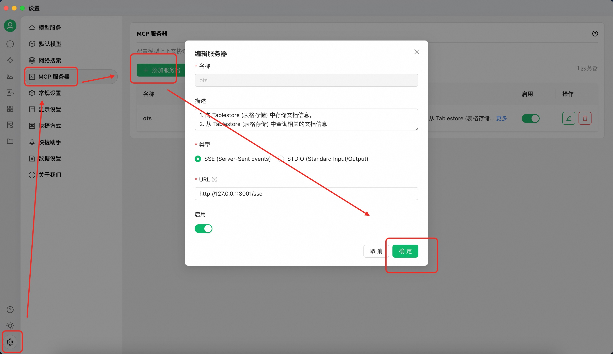

在聊天里使用MCP服务（可以把一些模版填充到 Cherry Studio 的模版里，生成一个自己的特殊助手，后续可以直接使用）：

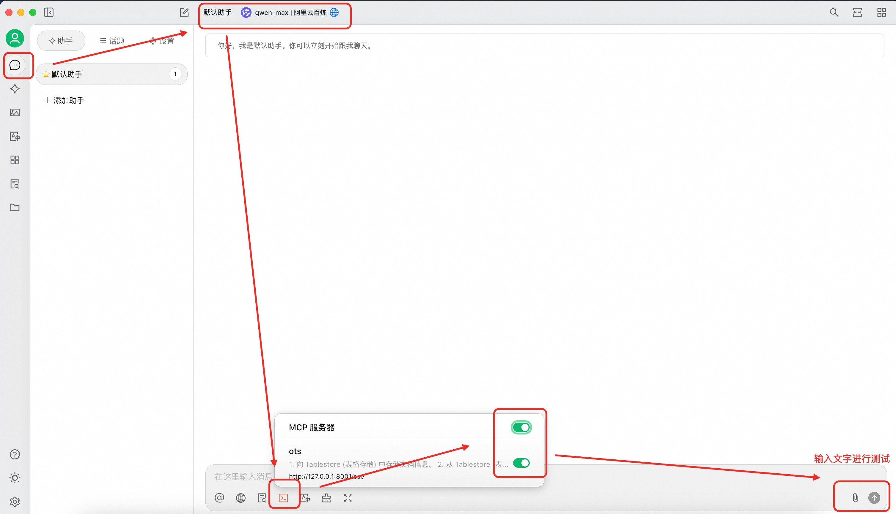


# 5.1 拓展应用场景
MCP 的 Tool 的能力和场景是 Tool 的描述来提供的，因此我们可以定义一些特殊的能力，可以发挥你的想象力。另外，当前我们没有接入一些复杂的多字段自由 Filter 能力、稀疏向量(Sparse Vector)能力，后续有时间会继续进行集成。

仅需要修改如下配置即可, 如何写可以参考 [settings.py](src/tablestore_mcp_server/settings.py)

```shell
  export TOOL_STORE_DESCRIPTION="你的自定义的描述"
  export TOOL_SEARCH_DESCRIPTION="你的自定义的描述"
```

修改后从 MCP Client 中可以看到工具 (Tool) 的描述已经变成了自定义的描述，那么大模型（LLM）就会根据你的描述去使用工具(Tool)。

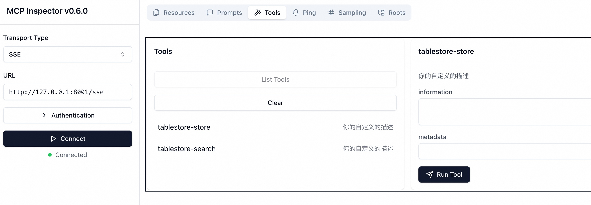

# 6. 贡献代码和二次开发

如果你需要基于此代码进行二次开发，可以参考如下。

## 6.1 依赖

1. [uv tool](https://docs.astral.sh/uv/)
    1. Make sure you are working with PyCharm version 2024.3.2 or later.
    2. [Configure a uv environment in PyCharm](https://www.jetbrains.com/help/pycharm/uv.html)
2. python 3.10

## 6.2 本地调试: sse 模式

首先在 PyCharm 里启动 `src/tablestore_mcp_server/main.py`即可，然后运行可视化调试界面 `MCP Inspector`, 根据 Terminal的日志提示打开"http://localhost:5173"进行调试。
```shell
  # 启动 MCP Inspector
  npx @modelcontextprotocol/inspector node build/index.js
```
即可连接并展示MCP的一些能力，我们这里仅仅使用了Tools，可以直接在界面上进行调试和运行。

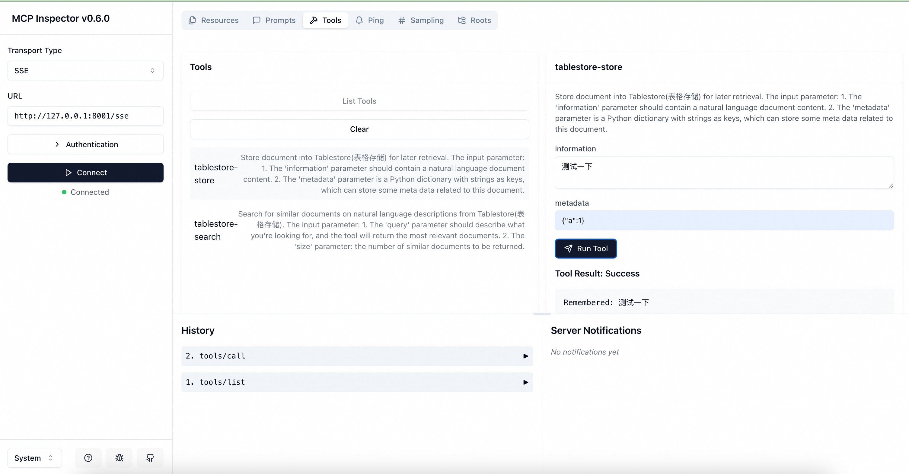

## 6.3 本地调试: stdio 模式
下面命令会自动运行 `MCP Inspector`，打开UI界面使用 stdio 进行链接即可，但是体验没有 sse 模式友好。因此建议 AI client 使用 sse 传输连接到 MCP 服务器，sse 模式可以轻松地与你的团队共享服务器或在云环境中使用。
```shell
  mcp dev src/tablestore_mcp_server/server.py
```

## 6.4 代码格式化和测试
运行测试前，需要配置Tablestore相关的4个环境变量。
```bash
   pytest --log-cli-level=INFO
```
提交代码前，自己运行代码检查和格式化。
```bash
   ruff check
   ruff format
```

## 6.5 发布
```
export UV_PUBLISH_TOKEN="xxxx"

rm -rf dist
uv build
uv publish
```