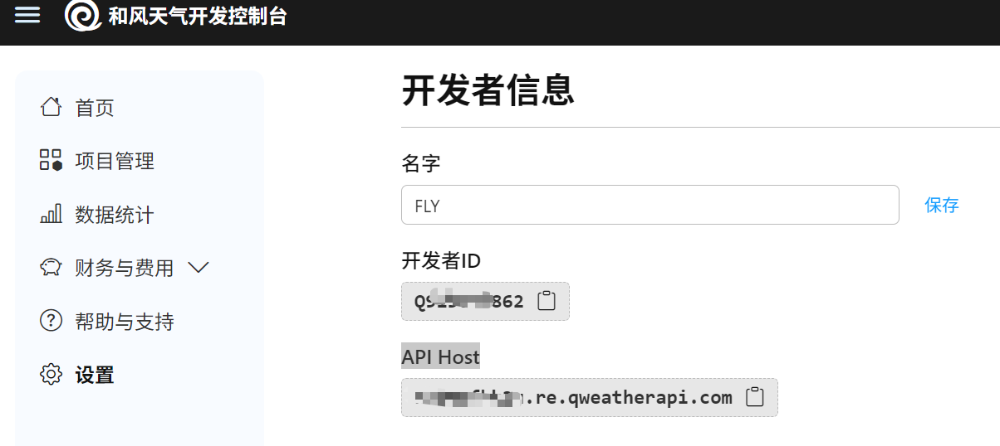

# MCP 天气工具演示

这个项目演示了如何使用 Model Context Protocol (MCP) 创建一个客户端-服务器架构，让 AI 模型可以通过工具获取实时天气信息。

## 项目介绍

本项目是一个基于 MCP（Model Context Protocol）的入门级 Demo，用于帮助开发者理解和使用 MCP 技术。项目展示了如何创建 MCP 服务器和客户端，以及如何实现服务器与客户端之间的交互。

MCP 是一种开放协议，允许大语言模型（如 Claude）与外部系统安全地交互，提供工具、数据访问以及环境信息。通过 MCP，AI 模型可以更加安全、高效地处理需要与外部系统集成的任务。

### 项目特点

- 简单易懂的 MCP 服务器实现
- 功能完整的 MCP 客户端示例
- 基于和风天气 API 的实际应用场景
- 详细的代码注释和文档说明
- 完整的部署和使用指南

## 项目架构

项目分为以下主要部分：

1. **MCP 服务器**：提供天气相关工具，包括获取天气预警和天气预报功能
2. **MCP 客户端**：连接服务器，发送工具调用请求，处理返回结果
3. **MCP Inspector**：用于调试和测试 MCP 服务器，提供可视化界面

### 技术栈

- **编程语言**：Python 3.10.12 ; Nodejs 22.14.0 ; Npm 10.9.2
- **部署环境**：Ubuntu 22.04
- **核心依赖**：
  - MCP SDK 1.5.0
  - HTTPX 库（HTTP 客户端）
  - 异步编程（asyncio）
- **调试工具**：
  - MCP Inspector (Node.js)

### 项目结构

```
mcp_demo/
│
├── server/                    # 服务器实现
│   └── weather_server.py      # 天气信息服务器
│
├── client/                    # 客户端实现
│   └── mcp_client.py          # MCP 客户端
│   └── mcp_client_deepseek.py # DeepSeek MCP 客户端（支持对话）
│
├── requirements.txt           # 项目依赖
├── run.sh                     # 运行脚本
└── README.md                  # 项目文档
```

### 系统交互图

```
┌─────────────┐     stdio    ┌──────────────┐
│             │◄────────────►│              │
│  MCP 客户端  │                MCP 服务器   │
│             │              │              │
└─────────────┘              └──────────────┘
                                   ▲
                                   │
                              调试 │
                                   │
                                   ▼
                            ┌─────────────┐
                            │             │
                            │MCP Inspector│
                            │             │
                            └─────────────┘
```

## 功能介绍

本项目提供以下功能：

1. **天气预警查询**：获取城市ID或经纬度位置的天气灾害预警信息
2. **天气预报查询**：根据城市ID或经纬度位置获取详细的天气预报

### 服务器实现说明

服务器实现提供了两个主要工具：

- **get_weather_warning**：获取指定城市ID或经纬度的天气灾害预警
- **get_daily_forecast**：获取指定城市ID或经纬度的天气预报

这些工具通过和风天气（QWeather）API 获取实时数据。

### 和风天气 API 注册与使用

要使用本项目，需要先注册和风天气开发者账号并获取 API Key：

1. **注册和风天气开发者账号**：
   - 访问 [和风天气开发服务](https://dev.qweather.com/)
   - 点击"注册"，按照提示完成账号注册

2. **创建项目并获取 API Key**：
   - 登录开发者控制台
   - 点击"项目管理" -> "创建项目"
   - 填写项目名称、创建凭据
   - 创建成功后，在项目详情页可以获取 API Key
  

3. **开发者的API Host**：
   - 登录开发者控制台
   - 点击"头像" -> "设置"，或直接访问https://console.qweather.com/setting?lang=zh
   - 查看API Host
   

4. **API 使用说明**：
   - 免费版API有调用次数限制，详情请参考[和风天气定价页面](https://dev.qweather.com/docs/pricing/)
   - 支持通过城市ID或经纬度坐标查询天气信息
   - 城市ID可通过[和风天气城市查询API](https://dev.qweather.com/docs/api/geoapi/)获取

### 客户端实现说明

客户端提供了一个简单的命令行界面，支持以下操作：

- 列出可用工具及其描述
- 调用工具并传递参数
- 显示工具执行结果
- 提供帮助信息

## 部署说明

### 环境要求

- Python 3.10.12 或更高版本
- Ubuntu 22.04 操作系统（也可在其他 Linux 发行版上运行）

### 安装步骤

1. **克隆项目**：

```bash
git clone https://github.com/your-username/mcp-in-action.git
cd mcp-in-action/mcp_demo
```

2. **创建并激活虚拟环境**：

```bash
python -m venv venv_mcp_demo
source venv_mcp_demo/bin/activate
```

3. **安装依赖**：

```bash
pip install -r requirements.txt
```

4. **设置和风天气 API Key 和 API Host**：
在`.env`文件配置`QWEATHER_API_KEY`和 `QWEATHER_API_KEY`

## 运行方式

### 方法一： 使用 MCP Inspector调试：

MCP Inspector 是一个可视化工具，可帮助调试和测试 MCP 服务器。要使用 MCP Inspector：

1. **安装 MCP Inspector**：

```bash
npm install -g @modelcontextprotocol/inspector
```

2. **使用 MCP Inspector 调试服务器**：

推荐使用简化命令 `mcp dev`：

```bash
mcp dev server/weather_server.py
```

或者使用 npx（如果未全局安装）：

```bash
npx @modelcontextprotocol/inspector python server/weather_server.py
```

3. **在浏览器中访问 Inspector**：

默认情况下，Inspector UI 运行在 http://localhost:6274，而 MCP 代理服务器运行在端口 6277。

4. **通过 Inspector 调试**：
   - 查看可用工具及其描述
   
   - 查询北京未来3天天气
   
   - 查询北京灾害预警
   

> **提示**：MCP Inspector 提供了更直观的界面来测试和调试 MCP 服务器，特别适合开发和调试复杂工具。


### 方法二：使用Python启动客户端

```bash
python client/mcp_client.py
```
#### 调用示例
```bash
(venv_mcp_demo) root@fly:~/AI-Box/code/rag/mcp-in-action/mcp_demo# python client/mcp_client.py
启动 MCP 服务器进程...
已连接到服务器，可用工具: 2
  - get_weather_warning: 
    获取指定位置的天气灾害预警
    
    参数:
        location: 城市ID或经纬度坐标（经度,纬度）
                例如：'101010100'（北京）或 '116.41,39.92'
        
    返回:
        格式化的预警信息字符串
    
  - get_daily_forecast: 
    获取指定位置的天气预报
    
    参数:
        location: 城市ID或经纬度坐标（经度,纬度）
                例如：'101010100'（北京）或 '116.41,39.92'
        days: 预报天数，可选值为 3、7、10、15、30，默认为 3
        
    返回:
        格式化的天气预报字符串
    

使用 'help' 查看帮助，使用 'exit' 退出

> help

可用命令:
  help - 显示此帮助信息
  list - 列出可用工具
  call <工具名> <参数JSON> - 调用工具
  exit - 退出程序

示例:
  call get_weather_warning {"location": "101010100"}
  call get_daily_forecast 116.41,39.92
  call get_daily_forecast 101010100 7

```

##### 天气预警查询
```bash
> call get_weather_warning {"location": "101010100"}
正在调用工具...

结果:
[TextContent(type='text', text='当前位置 101010100 没有活动预警。', annotations=None)]
```

##### 天气预报查询
```bash
> call get_daily_forecast 101010100 7
正在调用工具...

结果:
[TextContent(type='text', text='\n日期: 2025-05-03\n日出: 05:13  日落: 19:11\n最高温度: 25°C  最低温度: 10°C\n白天天气: 晴  夜间天气: 晴\n白天风向: 西北风 1-3级 (3km/h)\n夜间风向: 西南风 1-3级 (3km/h)\n相对湿度: 15%\n降水量: 0.0mm\n紫外线指数: 9\n能见度: 25km\n\n---\n\n日期: 2025-05-04\n日出: 05:12  日落: 19:12\n最高温度: 25°C  最低温度: 12°C\n白天天气: 多云  夜间天气: 小雨\n白天风向: 南风 1-3级 (3km/h)\n夜间风向: 东北风 1-3级 (3km/h)\n相对湿度: 55%\n降水量: 0.0mm\n紫外线指数: 3\n能见度: 24km\n\n---\n\n日期: 2025-05-05\n日出: 05:11  日落: 19:13\n最高温度: 22°C  最低温度: 12°C\n白天天气: 小雨  夜间天气: 多云\n白天风向: 北风 1-3级 (3km/h)\n夜间风向: 北风 1-3级 (3km/h)\n相对湿度: 42%\n降水量: 5.1mm\n紫外线指数: 4\n能见度: 25km\n\n---\n\n日期: 2025-05-06\n日出: 05:10  日落: 19:14\n最高温度: 23°C  最低温度: 12°C\n白天天气: 多云  夜间天气: 晴\n白天风向: 南风 1-3级 (3km/h)\n夜间风向: 西南风 1-3级 (3km/h)\n相对湿度: 41%\n降水量: 0.0mm\n紫外线指数: 9\n能见度: 25km\n\n---\n\n日期: 2025-05-07\n日出: 05:09  日落: 19:15\n最高温度: 25°C  最低温度: 14°C\n白天天气: 晴  夜间天气: 多云\n白天风向: 西南风 1-3级 (3km/h)\n夜间风向: 西南风 1-3级 (3km/h)\n相对湿度: 65%\n降水量: 0.0mm\n紫外线指数: 4\n能见度: 25km\n\n---\n\n日期: 2025-05-08\n日出: 05:08  日落: 19:16\n最高温度: 25°C  最低温度: 15°C\n白天天气: 小雨  夜间天气: 多云\n白天风向: 西北风 1-3级 (16km/h)\n夜间风向: 西北风 1-3级 (16km/h)\n相对湿度: 76%\n降水量: 0.5mm\n紫外线指数: 4\n能见度: 24km\n\n---\n\n日期: 2025-05-09\n日出: 05:07  日落: 19:17\n最高温度: 24°C  最低温度: 15°C\n白天天气: 多云  夜间天气: 多云\n白天风向: 西北风 1-3级 (3km/h)\n夜间风向: 西北风 1-3级 (3km/h)\n相对湿度: 40%\n降水量: 0.0mm\n紫外线指数: 9\n能见度: 25km\n', annotations=None)]

```

### 方法三：使用Python启动客户端（DeepSeek）

#### DeepSeek MCP 客户端

这是一个基于模型上下文协议 (Model Context Protocol - MCP) 的客户端实现，集成了 DeepSeek API 来处理用户查询。该客户端能够连接到 MCP 服务器，利用 DeepSeek 的大语言模型能力来理解用户查询，并通过 MCP 工具（如天气查询/灾害预警）来执行相应的操作并返回结果。

##### 功能特点

* **MCP 集成**: 与兼容 MCP 协议的服务器建立连接和通信。
* **DeepSeek 驱动**: 使用 DeepSeek API (通过 OpenAI SDK 兼容接口) 处理自然语言查询。
* **工具调用**: 支持根据用户意图自动调用 MCP 服务器上定义的工具（例如 `get_daily_forecast`, `get_weather_warning`）。
* **交互式体验**: 提供一个简单的命令行界面 (CLI) 进行交互式问答。
* **稳健性**: 包含错误处理（连接、API 调用、工具执行）和资源管理（确保连接正确关闭）。
* **可配置**: 通过环境变量轻松配置 API 密钥、URL 和模型。
* **可扩展**: 易于通过修改系统提示或在 MCP 服务器端添加新工具来扩展功能。

在运行客户端之前，需要配置以下环境变量。修改名为 `.env` 的文件：

```dotenv
# .env 文件内容示例
DEEPSEEK_API_KEY=sk-xxxxxxxxx                # DeepSeek API 密钥
DEEPSEEK_BASE_URL=https://api.deepseek.com   # DeepSeek API 的基础 URL
DEEPSEEK_MODEL=deepseek-chat                 # 使用的 DeepSeek 模型名称
```

启动客户端
```bash
python client/mcp_client_deepseek.py
```
查询成都天气
```bash
(venv_mcp_demo) root@fly:~/AI-Box/code/rag/mcp-in-action/mcp_demo# python client/mcp_client_deepseek.py
2025-05-03 13:42:25,059 - INFO - 成功连接到 MCP 服务器
2025-05-03 13:42:25,059 - INFO - 开始聊天会话...

请输入您的问题 (输入 'quit' 或 'exit' 退出): 成都天气
2025-05-03 13:42:39,345 - INFO - HTTP Request: POST https://api.deepseek.com/chat/completions "HTTP/1.1 200 OK"
2025-05-03 13:42:44,761 - INFO - 执行工具 get_daily_forecast，参数: {'location': '101270101', 'days': 3}
2025-05-03 13:42:44,985 - INFO - 工具执行完成: get_daily_forecast
2025-05-03 13:42:45,055 - INFO - HTTP Request: POST https://api.deepseek.com/chat/completions "HTTP/1.1 200 OK"

助手: 以下是成都市未来3天的天气预报：

**2025年5月3日（周六）**
- 天气：白天阴，夜间阴
- 温度：最高31°C，最低19°C
- 风向：北风1-3级（3km/h）
- 相对湿度：66%
- 降水量：0.0mm
- 紫外线指数：5（中等）
- 能见度：25km

**2025年5月4日（周日）**
- 天气：白天多云，夜间小雨
- 温度：最高28°C，最低18°C
- 风向：北风1-3级（3km/h）
- 相对湿度：79%
- 降水量：0.0mm
- 紫外线指数：6（中等）
- 能见度：24km

**2025年5月5日（周一）**
- 天气：白天阴，夜间小雨
- 温度：最高30°C，最低18°C
- 风向：北风1-3级（3km/h）
- 相对湿度：75%
- 降水量：0.0mm
- 紫外线指数：11（极高）
- 能见度：25km

请注意，5月4日和5月5日夜间有小雨，建议携带雨具。5月5日的紫外线指数较高，外出时请注意防晒。
```

查询成都灾害预警
```bash
请输入您的问题 (输入 'quit' 或 'exit' 退出): 成都灾害预警
2025-05-03 13:44:17,993 - INFO - HTTP Request: POST https://api.deepseek.com/chat/completions "HTTP/1.1 200 OK"
2025-05-03 13:44:23,186 - INFO - 执行工具 get_weather_warning，参数: {'location': '101270101'}
2025-05-03 13:44:23,434 - INFO - 工具执行完成: get_weather_warning
2025-05-03 13:44:23,522 - INFO - HTTP Request: POST https://api.deepseek.com/chat/completions "HTTP/1.1 200 OK"

助手: 目前成都市没有活动的天气灾害预警。

请输入您的问题 (输入 'quit' 或 'exit' 退出): quit
2025-05-03 13:44:33,812 - INFO - 结束聊天会话...
2025-05-03 13:44:33,940 - INFO - 服务器资源清理完成

```
## 常见问题

### 服务器无法启动

- 确保已安装所有依赖
- 检查 Python 版本是否 3.10 或更高版本
- 检查服务器文件权限是否正确
- 确保 QWEATHER_API_KEY 环境变量已正确设置

### API 请求失败

- 确保网络连接正常
- 检查 API Key 是否有效
- 和风天气免费版 API 有请求次数限制
- 检查请求参数格式是否正确

## 使用 MCP Inspector 调试与故障排除

MCP Inspector 是开发和调试 MCP 服务器的重要工具，提供了直观的可视化界面，帮助开发者理解和解决问题。

### Inspector 的主要功能

1. **实时工具调用**：
   - 通过界面直接调用 MCP 工具
   - 可视化参数表单，避免语法错误
   - 查看格式化的执行结果

2. **请求历史记录**：
   - 跟踪所有工具调用历史
   - 复制和重放之前的请求
   - 对比不同参数下的执行结果

3. **错误分析**：
   - 详细的错误消息和堆栈跟踪
   - 突出显示参数验证错误
   - 显示请求/响应时间，帮助性能分析

4. **流式响应可视化**：
   - 查看支持流式传输的工具的实时输出
   - 分析流式传输过程中的延迟

### 常见调试场景

#### 1. 参数验证错误

当工具参数格式不正确时：

```bash
npx @modelcontextprotocol/inspector python server/weather_server.py
```

在 Inspector 中：
1. 选择工具（如 `get_daily_forecast`）
2. 故意提供错误格式的参数（如字符串而非数字）
3. 执行后，Inspector 会显示详细的验证错误

#### 2. API 集成问题

当外部 API 调用失败时：

```bash
npx @modelcontextprotocol/inspector python server/weather_server.py
```

在 Inspector 中：
1. 调用 `get_weather_warning` 或 `get_daily_forecast` 工具
2. 检查网络请求错误信息
3. 分析响应码和错误消息

#### 3. 性能分析

分析工具执行时间：

```bash
npx @modelcontextprotocol/inspector python server/weather_server.py
```

在 Inspector 中：
1. 调用目标工具多次，使用不同参数
2. 分析每次调用的执行时间
3. 识别性能瓶颈

### 调试最佳实践

1. **先用 Inspector，再集成客户端**：
   - 在开发新工具时，先用 Inspector 测试和完善
   - 确保工具正常工作后再集成到客户端

2. **保存常用测试用例**：
   - 使用 Inspector 的"保存请求"功能
   - 创建不同场景的测试用例集

3. **使用 CLI 模式进行自动化测试**：
   ```bash
   npx @modelcontextprotocol/inspector --cli python server/weather_server.py --method tools/call --tool-name get_weather_warning --tool-arg location=101010100
   ```

4. **对比服务器版本**：
   - 使用相同参数测试不同版本的服务器实现
   - 分析性能和行为差异

通过有效使用 MCP Inspector，可以显著提高开发效率，减少调试时间，并确保 MCP 服务器的稳定性和可靠性。

## 扩展与优化

1. **添加更多工具**：可以扩展服务器添加更多工具，如历史天气数据查询、未来几天预报等
2. **支持更多数据源**：集成其他天气 API，提供全球天气信息
3. **改进用户界面**：开发图形用户界面，提供更直观的操作体验
4. **添加用户认证**：增加安全措施，实现用户认证和权限控制
5. **优化性能**：添加缓存机制，减少 API 请求次数

## 联系与贡献

欢迎贡献代码或提出改进建议，可以通过以下方式联系：

- 提交 Issue
- 发送 Pull Request
- 发送邮件至：fly910905@sina.com

## 许可证

本项目采用 MIT 许可证，详情请参阅 LICENSE 文件。
